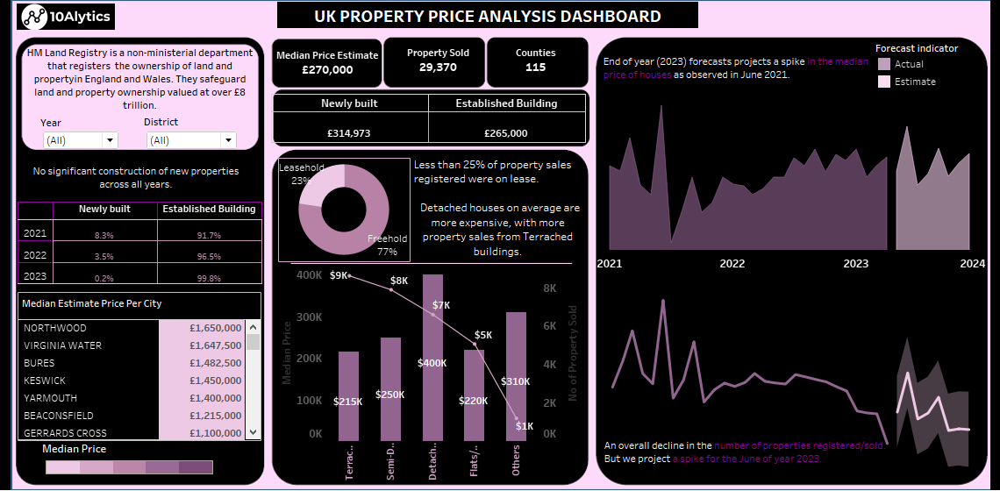
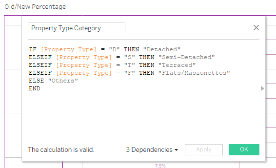

# DahelJune
This is a test in class

## Introduction

This is an analysis of the Sales performance of AdventureWorksDW. It is done by analyzing data from different schemas on the AdventureWorks DWdatabase. I anlyzed data from dim_customers table, dim_date table, dim_product table, dim_territory sales and fact_internet sales table. I used SQL to query the data from the database and imported into PowerBI where the actual analysis was carried out.

**Disclaimer** This is not a real company as we know that adventure works DW database is compiled by Microsoft for learning purposes.

## Problem Statement

The goal of this analysis is to
- Determine the current market demand for products and how it varies by region/location
- Know the current sales performance and how it compares to past performance and industry benchmarks
- identify the areas where sales performance is lacking or could be improved.
-	To discover target markets or goods that have the greatest impact on sales success.

- Finally, the goal is to create data-driven plans that can aid in increasing sales, improving customer happiness, and driving corporate growth.

tyuyuyuyuyuioyuioyiuyiuyiy

my model                       |        powerbi model
:----------------------------: | :----------------------------:
             | 
